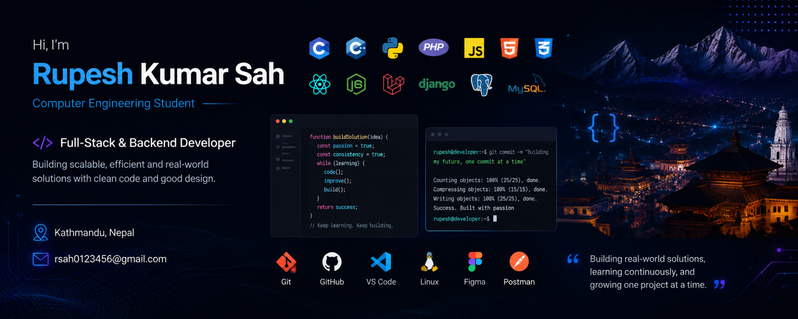

<!-- ═══════════════════════════════════════════════════════════ -->
<!--            1. LIVE TERMINAL — NEOFETCH                     -->
<!-- ═══════════════════════════════════════════════════════════ -->

<h2><code>The Cipher Stack</code> · Rupesh Kumar Sah</h2>

<table>
  <tr>
    <td valign="top">
      
    </td>
    <td valign="top">
      
    </td>
  </tr>
</table>

 

---

<!-- ═══════════════════════════════════════════════════════════ -->
<!--            2. CINEMATIC HEADER                             -->
<!-- ═══════════════════════════════════════════════════════════ -->

 

&nbsp;

&nbsp;

  

  

---

<!-- ═══════════════════════════════════════════════════════════ -->
<!--            3. LIVE TERMINAL — CONTRIBUTIONS                -->
<!-- ═══════════════════════════════════════════════════════════ -->

<h3><code>Contributions</code></h3>

 

---

<!-- ═══════════════════════════════════════════════════════════ -->
<!--                    FEATURED GALLERY                       -->
<!-- ═══════════════════════════════════════════════════════════ -->

### Featured Gallery — The Best of Rupesh
 

<table border="0">
  <tr>
    <td align="center" width="50%">
      
       
      <b>hospital-real-one</b> 
      Healthcare management and patient operations platform <a href="https://github.com/rupesh-kumar-sah/hospital-real-one">View source repository</a>
    </td>
    <td align="center" width="50%">
      
       
      <b>kheti-pro</b> 
      Agri-tech platform focused on farming workflows and growth <a href="https://github.com/rupesh-kumar-sah/kheti-pro">View source repository</a>
    </td>
  </tr>
  <tr>
    <td align="center" width="50%">
      
       
      <b>lexicon-books-</b> 
      Books selling app and digital reading storefront <a href="https://github.com/rupesh-kumar-sah/lexicon-books-">View source repository</a>
    </td>
    <td align="center" width="50%">
      
       
      <b>shoppingnp</b> 
      E-commerce platform for online shopping experiences <a href="https://github.com/rupesh-kumar-sah/shoppingnp">View source repository</a>
    </td>
  </tr>
</table>

---

<!-- ═══════════════════════════════════════════════════════════ -->
<!--                    TECH ARSENAL                           -->
<!-- ═══════════════════════════════════════════════════════════ -->

### Tech Arsenal
 

<table>
<tr>
<td align="center" width="50%">

<strong>Frontend and 3D</strong>

</td>
<td align="center" width="50%">

<strong>Backend and Data</strong>

</td>
</tr>
<tr>
<td align="center">

<strong>Mobile</strong>

 React Native

</td>
<td align="center">

<strong>Tools and DevOps</strong>

</td>
</tr>
</table>

 
<strong>Computer Networking & CCNA</strong>
 

---

<!-- ═══════════════════════════════════════════════════════════ -->
<!--               CURRENTLY BUILDING                          -->
<!-- ═══════════════════════════════════════════════════════════ -->

### What I Am Up To

<table>
<tr>
<td><b>Currently Building</b></td>
<td>Full-stack web and mobile products with clean architecture and real-world business logic</td>
</tr>
<tr>
<td><b>Currently Learning</b></td>
<td>Advanced backend design, secure systems, performance tuning, and software scalability</td>
</tr>
<tr>
<td><b>Ask Me About</b></td>
<td>API design, database workflows, Laravel/Django architecture, and full-stack product engineering</td>
</tr>
<tr>
<td><b>Fun Fact</b></td>
<td>I enjoy turning messy requirements into systems that are stable, practical, and easy to scale</td>
</tr>
</table>

---

<!-- ═══════════════════════════════════════════════════════════ -->
<!--                  GITHUB ACHIEVEMENTS                      -->
<meta charset=